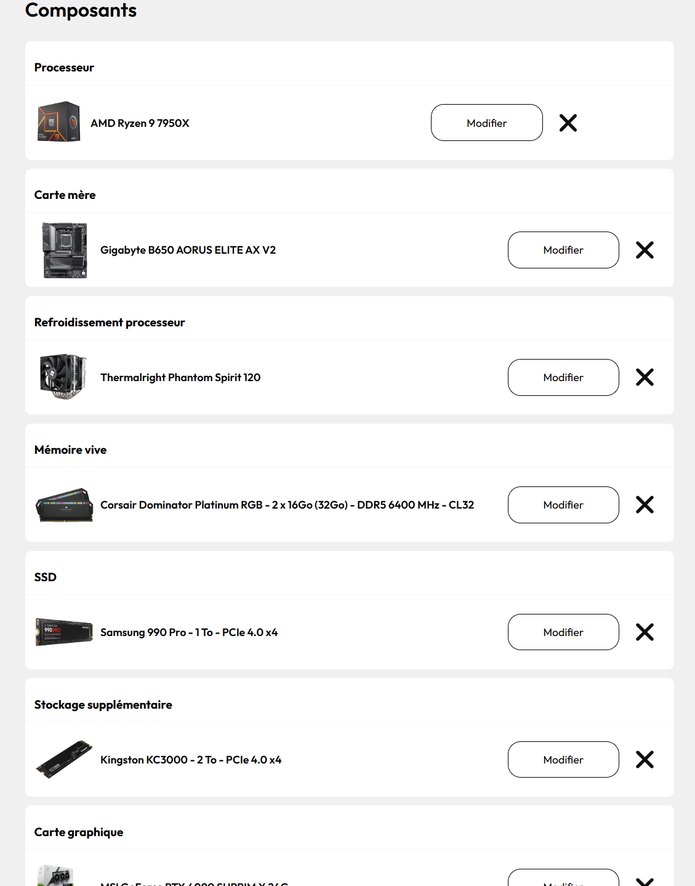

## 0xMich

## 👋・Hello !
I'm Michel !

I’m a junior developer passionate about finding creative solutions and working on innovative projects. \
I have experience with a range of programming languages and enjoy working with frameworks.

## 🌱・My projects

### Boulonais Urban Community [North of France] Dashboard & Mail Auto Banner
I worked on a platform designed to manage email signatures and communication banners in Outlook. This platform allows administrators to automatically generate HTML and CSS banners for email signatures, which can be customized through an intuitive dashboard.
Administrators can update the banner link, and changes are automatically propagated via a PowerShell script deployed to network PCs using a GPO (Group Policy Object).

- **Technologies used** : Vue.js, Scss, PowerShell, LDAPS, Active Directory

### PC Configuration & Database Management
This project involved developing a web application using Nuxt.js that enables users to configure hardware and software components for PCs. The platform provides a user-friendly interface to add, modify, and display configurations, simplifying IT resource management.
The database is used to retrieve categories and components, enabling dynamic updates and centralized storage of configurations.

- **Technologies used** : Nuxt.js (Vue.js framework), Scss, Node.js, MySQL

## 💻・Skills and masteries

 
 

  <table>
    <tr>
      <td align="center" width="96">
          
         JavaScript
      </td>
      <td align="center" width="96">
          
         Typescript
      </td>
      <td align="center" width="96">
          
         ReactJs
      </td>
      <td align="center" width="96">
          
         NextJs
      </td>
      <td align="center" width="96">
          
         VueJs
      </td>
      <td align="center" width="96">
          
         NuxtJs
      </td>
    </tr>
    <tr>
      <td align="center" width="96">
          
         NodeJs
      </td>
      <td align="center" width="96">
          
         NestJs
      </td>
      <td align="center"  width="96">
          
         Strapi
      </td>
       <td align="center" width="96">
          
         Postgres
      </td>    
      <td align="center"  width="96">
          
         Jest
      </td>        
      <td align="center" width="96">
          
         Storybook
      </td>
    </tr>
    <tr>
      <td align="center" width="96">
          
         Docker
      </td>            
      <td align="center" width="96"> 
          
         Heroku
      </td>
      <td align="center" width="96">
          
         Vercel
      </td>
      <td align="center"  width="96">
          
         Cloudflare
      </td>
      <td align="center"  width="96">
          
         Tailwind CSS
      </td>      
      <td align="center"  width="96">
          
         Git
      </td>     
    </tr>
  </table>

## 📮・Contact
- Discord: .misterpc
